> 课程讲解过程中，动不动就小结，就是为了能通过遗忘曲线，加强记忆

# 思维导图

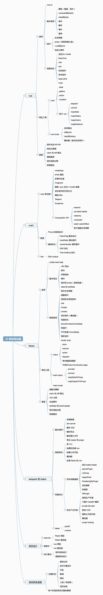

## 代码路径：[git.imooc.com/code-xx](https://git.imooc.com/coding-419/frame-project-interview)

## 面试题：

1. React 组件如何通讯？
2. JSX 本质是什么？
3. context 是什么，有何用途？
4. shouldComponentUpdate 的用途
5. 描述 redux 单向数据流
6. setState 是同步还是异步？

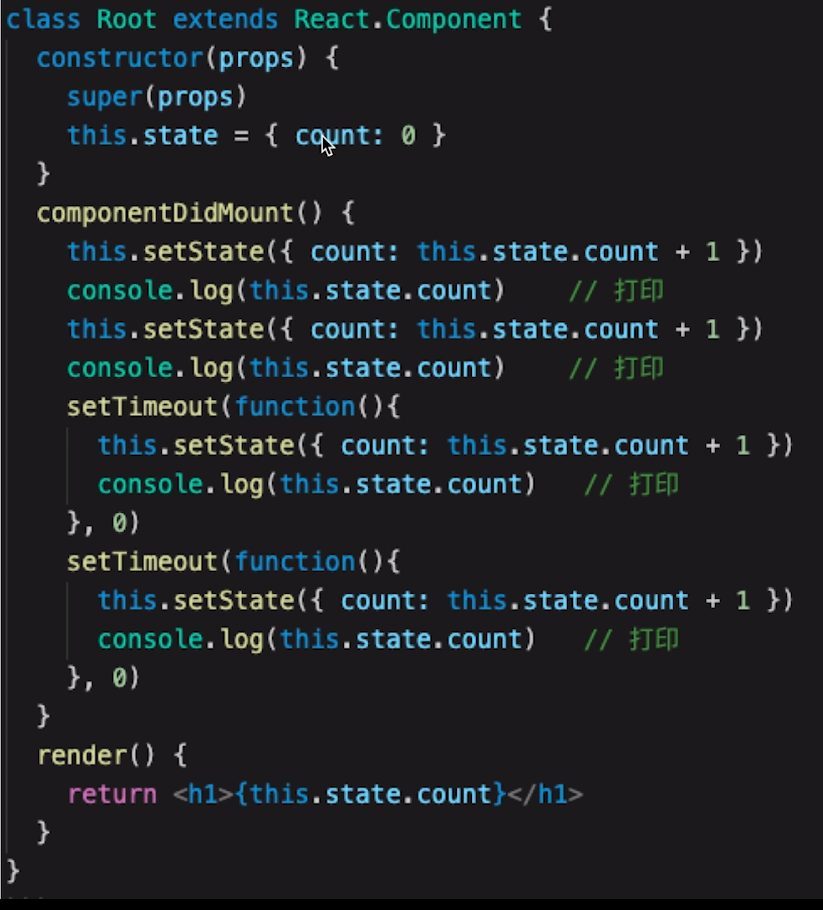

## react 17

> 与 react 16 基本一致

## React 基本使用

1. 富文本

   ```
   const rawHtmlData = {   }
   <p dangerouslySetInnerHTML={rawHtmlData}></p>
   ```

   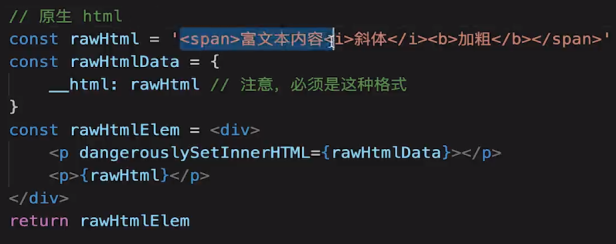

2. react key: 必填，不能是 index 或 random
3. react 事件 为何 bind this？
   - func(){} //这种写法 this 的默认值是 undefined
   - 在 construct 中 bind 比在调用时 bind 要更好，只绑定一次
   - 用箭头函数（静态方法），this 指向当前实例（推荐，需要 babel）
4. event // react 做了封装，不是原生 event

   - 通过**proto**.constructor 是 SyntheticEvent
   - event.nativeEvent 才是原生对象
   - 用 event.target,不用 event.currentTarget(假象)
   - react 16 所有的事件，都被挂在到 document 上，react 17 事件绑定到 root 组件上（初始化 react 组件时传入的根 dom 节点（一般为 app)),有利于多个 React 版本并存（微前端）。
     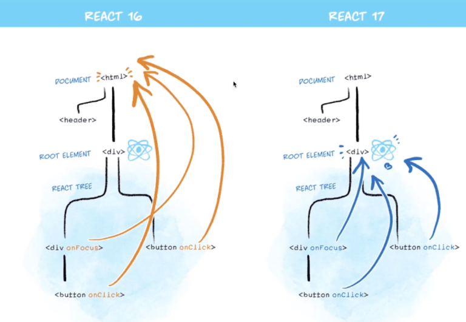
   - 不传参，第一个参数就是 event，有传参最后一个参数是 event

5. 受控组件
   - 组件显示 state 值，通过事件触发函数，修改 state 值，实现受控
6. 组件传参：props=>state
7. 状态（数据）提升：将子组件共用的数据，提升至其共同的父组件；子组件只负责渲染即可
8. 使用 props types 对组件 props 进行类型检查，还可以充当文档

## 7-9 setState 相关

1.  setState 为何使用**不可变值**(函数式编程，纯函数)
1.  数组，没有副作用的方法可以用，concat\[...arr,newNum]\slice\filter\map 可以；push\pop\splice 不可以
1.  其他必须用副作用方法的，应该先复制（深拷贝 arr.slice, Object.assign(),{...obj,a:100}）原有数组对象，在操作复制后的数组对象
1.  不用不可变值的话，在 shouldComponentUpdate 里会不好使
1.  setState 可能是异步更新

- 正常代码中，是异步的；通过 setState 的第二个参数可以同步拿到变化后的值
- setTimeout 中是同步的
- 自己定义的 dom 事件，是同步的


    ```
      document.body.addEventListener('click',()=>{
        // unmount时记得清楚，避免内存泄漏
        this.setState({count:this.state.count+1})
        console.log('此时是同步的加过1的count',this.state.count)
      })
    ```

3. setState 可能会被合并

   1. 传入对象，会被合并，执行一次，类似 Objcet.assign(),(合并 key 值相同的对象)
      ```
      this.setState({xx:this.state.xx+1})
      this.setState({xx:this.state.xx+1})
      this.setState({xx:this.state.xx+1})
      ```
   2. 传入函数，不会合并，执行 n 次

      ```
      this.setState((pState,props)=>{xx:this.state.xx+1})
      this.setState((pState,props)=>{xx:this.state.xx+1})
      this.setState((pState,props)=>{xx:this.state.xx+1})
      ```

## 7-12 组件生命周期

- [生命周期图解](https://projects.wojtekmaj.pl/react-lifecycle-methods-diagram/)
- 为啥在 didmount 里调用 ajax 等？
  - render 阶段：纯净不包含副作用，但可能被 react 暂停、终止、重启，不可控
  - commit 阶段（didmount）可以使用 dom，运行副作用、安排更新
  - 父子组件生命周期 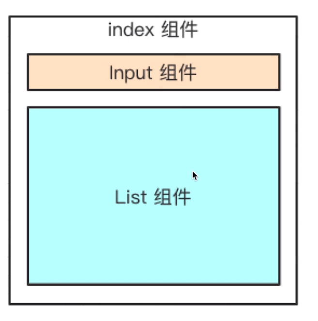
    - react: f constructor->f willmount-> z constructor -> z willmount -> z didmount -> f didmount
    - create\beforeUpdate：从父到子
    - mounted\updated: 从子到父
    - willUnmount：从子到父？
    - vue 挂载:父 beforeCreate => 父 created => 父 beforeMount => 子 beforeCreate => 子 created => 子 beforeMount => 子 mounted => 父 mounted
    - vue 更新子组件：父 beforeUpdate => 子 beforeUpdate => 子 updated => 父 updated
    - vue 删除子组件：父 beforeUpdate => 子 beforeDestroy => 子 destroyed => 父 updated
- 挂载（construct\render\didmount)、更新(new props、setState()、forceUpdate()\shouldUpdate\render\didUpdate)、卸载(willUnmount)

## React 高级特性

### 7-14 函数组件 （和 class 组件对比）

- 纯函数，输入 props，输出 jsx
- 没有实例，没有生命周期，没有 state
- 不能扩展其他方法

### 非受控组件

#### 注意事项

1. ref
2. defaultValue defaultChecked
3. 手动操作 DOM 元素

```
<input type='file'>
```

#### 使用场景

- 必须手动操作 dom 元素，setState 实现不了
- 文件上传 <input type='file'>
- 某些富文本编辑器，需要传入 dom 元素

### Portals （传送门）

- 组件默认会按照既定层次嵌套渲染，为了让组件渲染到父组件以外

```
  render(){
    return ReactDOM.createProtal(
      <div style={{position:'fixed',top:0,left:0}}>{this.props.children}</div>,
      document.body
    )
  }
```

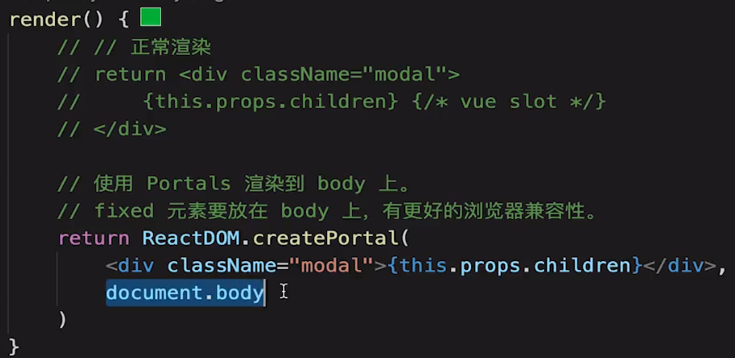

- 使用场景：overflow：hidden\父组件 z-index 值太小\ fixed 需要放在 body 第一层级等一些 css 兼容性、布局等

### Context

> 使用场景，只是为了层级传递的简单数据，如 主题、语言（中英文等）信息

- 公共信息（语言、主题）传递给每个组件，props 太繁琐，redux 小题大做，用 context 比较好

```
   // 步骤1 创建 context，填入默认值（任意js变量）     const ThemeContext = React.createContext('lighnt')
```

- 最外层作为数据产生方

```
// 步骤2
<ThemeContext.Provider value={this.state.theme}>
  <ChildrenComponent />
</ThemeContext.Provider>
```

- 消费、应用方

```
// 步骤3 指定contextType 读取当前的theme context
ThemedButton.contextType = ThemeContext // 方法1
class ThemedButton extends React.Component{
  render(){
    // static contextType = ThemeContext; // 步骤3 方法2，es6语法
    // react会往上找最近的theme provider
    // 步骤4
    const theme = this.context
    return <div>this theme is {theme}</div>
  }
}

// 函数式组件消费
function ThemeLink(props){
  // 无法使用 theme = this.context，没有实例(this)可用
  // 步骤3
  return <ThemeContext.Consumer>
  // 步骤4
    {value=><div>this theme is {value}</div>}
  </ThemeContext.Consumer>
}
```

- 修改方

### 异步组件（懒加载）,组件、项目较大，路由加载时使用

- import()
- React.lazy / React.Suspense

```
const ContextDemo = React.lazy(()=>import('./ContextDemo))

...

render(){
  return <React.Suspense fallback='Loading...'>
  <ContextDemo/>
  </React.Suspense>
}
```

### 性能优化（对 react 比 vue 重要）

1. shouldComponentUpdate(简称 scu)

- 通过判断，控制组件是否渲染，从而减少渲染，优化性能(默认返回 true)
- 为啥 react 不默认进行比较，来优化性能，却让用户自己控制是否返回 false？
  为了避免用户使用 push 等错误写法以后，组件无法刷新
- 7-20 兄弟组件更新了，自己也更新(兄弟组件更新——》父组件更新——》自己更新); React 默认：父组件有更新，子组件无条件更新（scu 默认为 true），所以 react 性能优化比 vue 更重要。
- scu 不一定每次都用，不卡就不需要优化。在对比时，需要使用深度递归（isEqual 等）时，消耗的性能比优化的性能还高，就不要用了。

2. setStae 不可变值,可以引入 immutable.js 来校验,彻底拥抱"不可变值"

- immutable 基于共享数据，不是深拷贝，速度好;缺点：有一定学习和迁移成本，按需使用

```
const map1 = Immutable.Map({a:1,b:2})
const map2 = map1.set('b',50)
map1.get('b') //2
map2.get('b') //50
```

```
// 不可变值正确写法
this.setState({list:this.state.list.concat({id:1})})

// 错误写法
this.state.list.push({id:1})
this.setState({
  list:this.state.list // 此时在scu中进行比较nextState和this.state，会相等的bug
})
```

1. PureComponent（纯组件）和 React.memo（备忘录，函数组件中的 PureComponent）

- PureComponent，scu 中实现了浅比较（尽量不用深比较，过于消耗性能），要求我们设计组件 state 结构时要尽量浅一些

```
class List extends React.PureComponent{
  ...
  // 会隐藏一个自带浅比较的shouldComponentUpdate生命周期
}

// 函数式组件 memo 的使用
function MyComp (props){
  // 使用props渲染
}

function areEqual(prevProps,nextProps){
  // 根据条件，判断是否返回true
}
export default React.memo(MyComponent, areEqual);
```

### 高阶组件 HOC (high order component,一种类似工厂的设计模式)

- mixin 也是用于组件公共逻辑的抽离，但会增加组件耦合度，已被 React 启用
  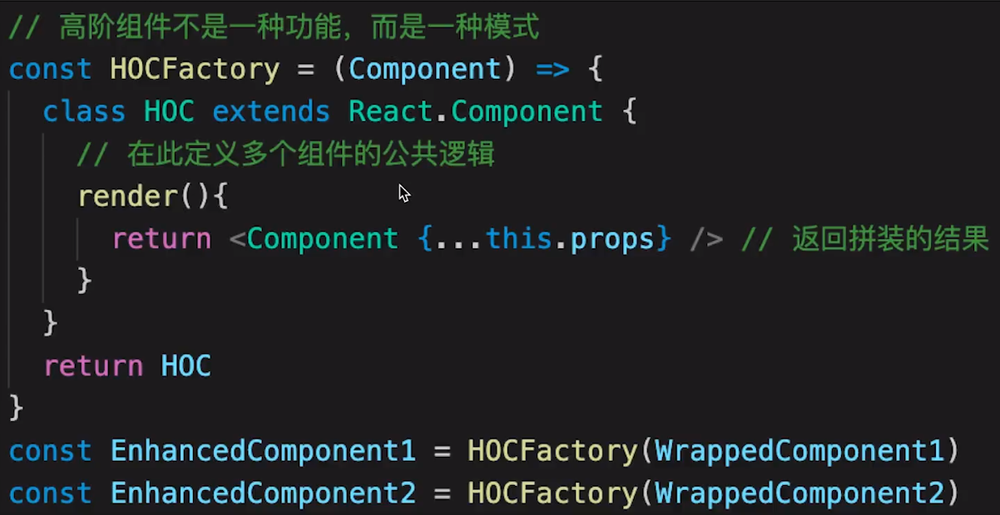
  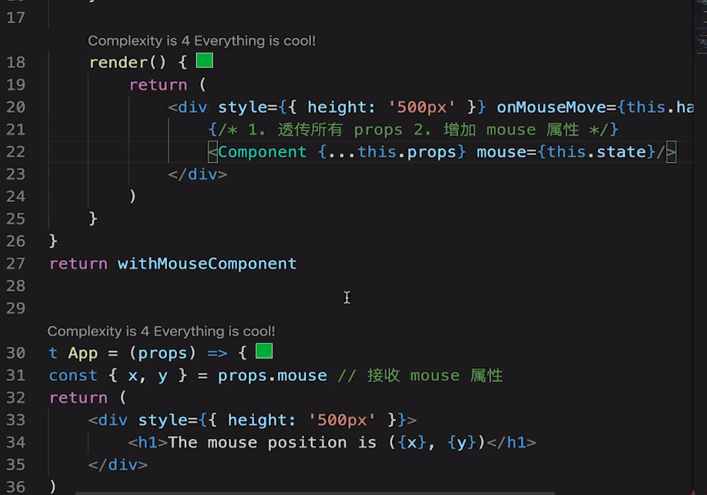
- redux connect
  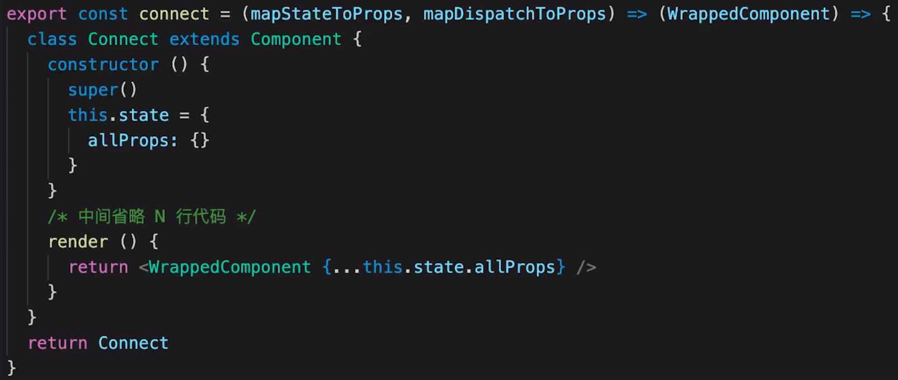

### 高阶组件 Render Props

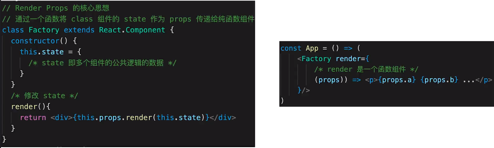
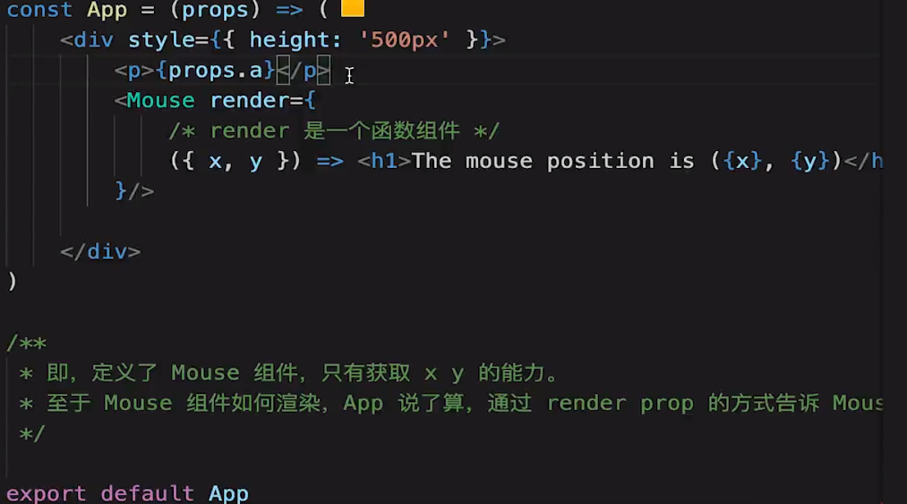

- hoc:模式简单，但会增加组件层级
- render props：代码简洁，学习成本较高

## Redux (redux.org.cn 自述)不可变值、函数式编程

### 基本概念

- store state
- action
- reducer

### 单项数据流

- dispatch(action)
- reducer->newState
- subscribe 触发通知
  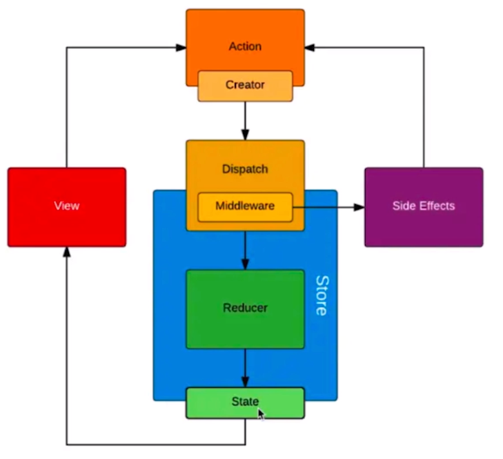

### react-redux

- `<Provider>`
- connect
- mapStateToProps mapDispatchToProps

### 异步 action

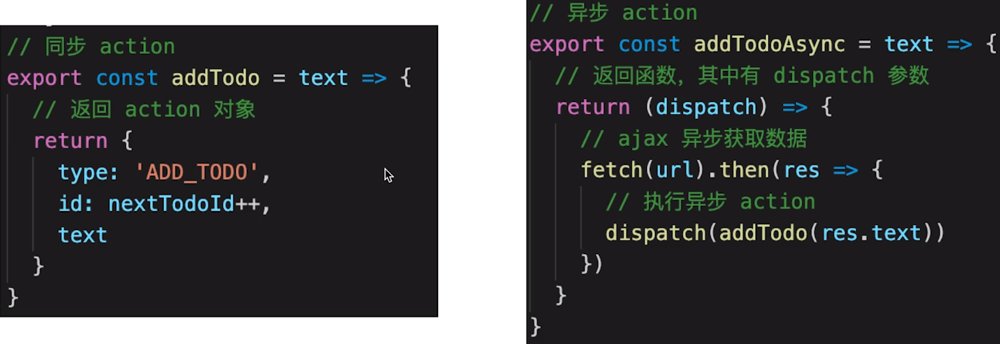
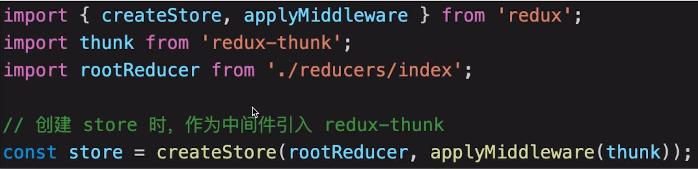

### 中间件

- redux-thunk
- redux-promise
- redux-saga
- redux-logger
  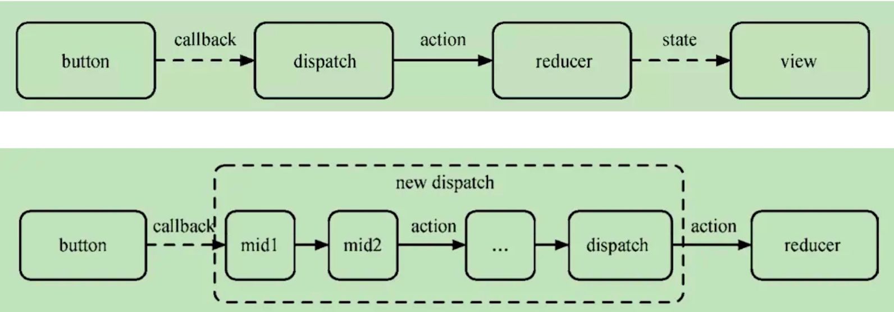

## React-router,同 vue-router

### 路由模式

- hash（默认），建议 to B 业务使用，如 http://abc.com/#/user/10
- H5 history(需要 server 端支持），建议 to C 业务使用，更优雅，如 http://abc.com/user/20

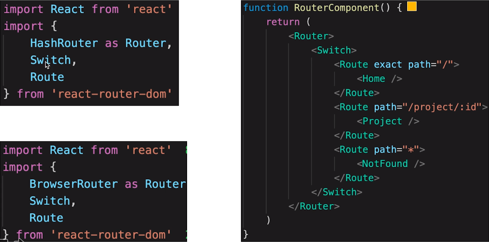

### 路由配置 动态路由

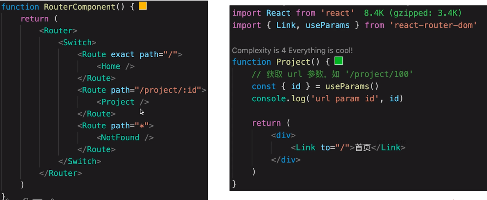

#### 跳转路由

- 方法 1：`<Link to="/">首页</Link>`
- 方法 2：js 跳转 useHistory().push('/')
  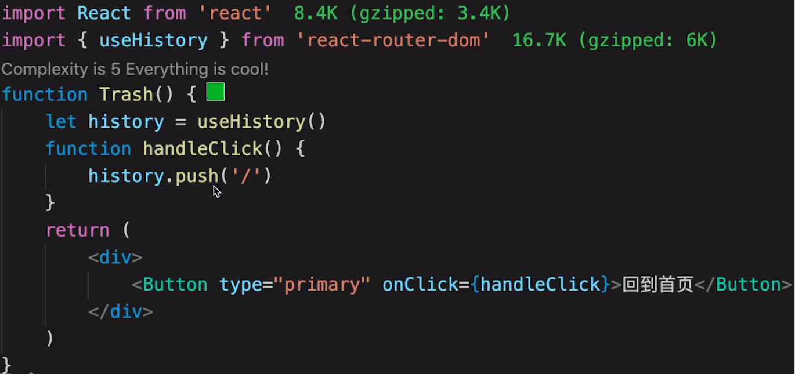

### 懒加载

> 使用 lazy、Suspense
> 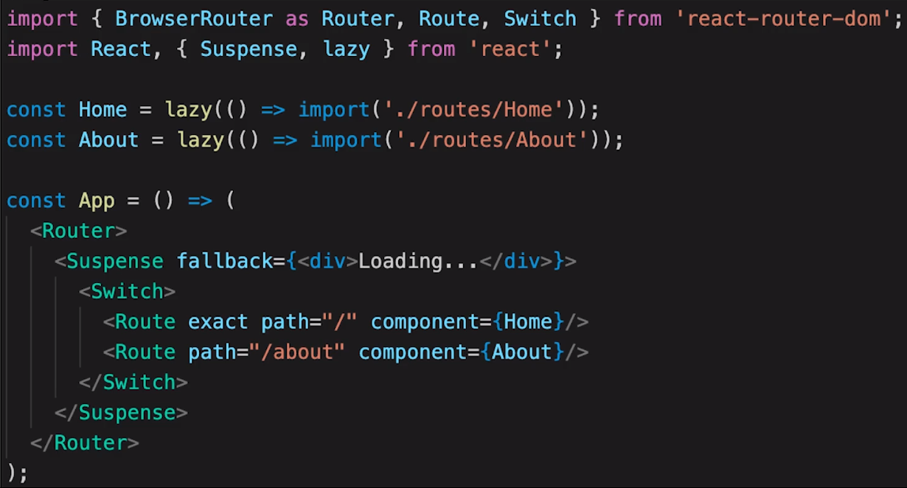
