# 函数式编程

> 一种编程范式

- 纯函数
- 不可变值

# vdom 和 diff

## diff 算法

# JSX 本质

> JSX 等同与 vue 模板，Vue 模板不是 html，JSX 也不是 js

- JSX 编译演示：babel 官网-》试一试-》选中 react 依赖
  

# React 的合成事件机制

> react 16 所有事件都挂载到 document 上，react 17 所有事件改为挂载到根元素上

- react event 不是原生的，是 SyntheticEvent 合成事件对象
- 更好的兼容性和跨平台
- 挂载到 document(根节点 root 组件,有利于多个 React 版本共存)上，减少内存消耗，避免频繁解绑
- 方便事件的统一管理（如事务机制）

- react 16 合成事件图示：
  

# batchUpdate 机制

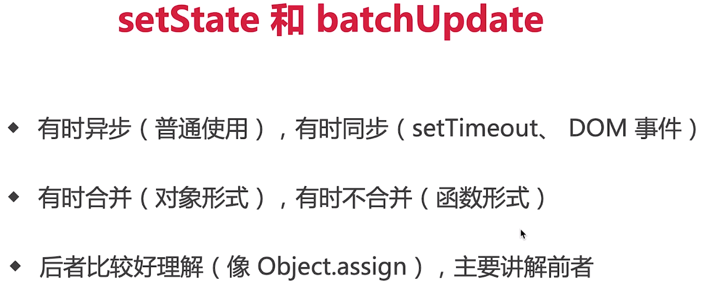

## setSate 主流程

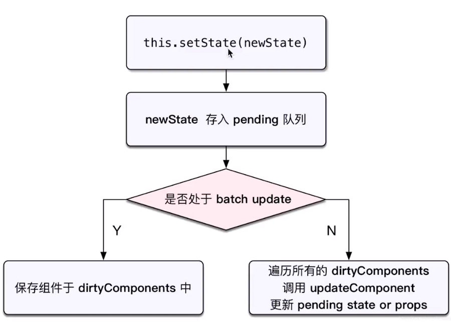
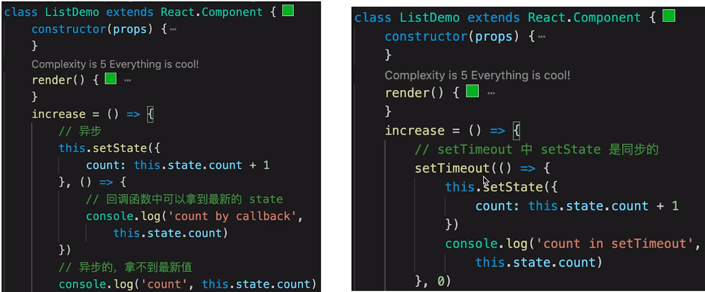
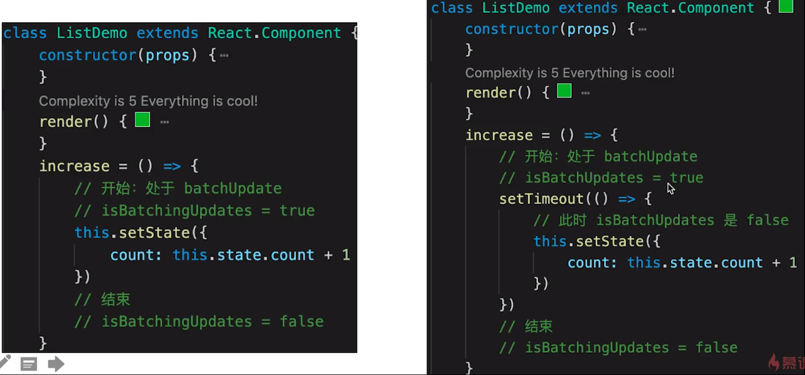
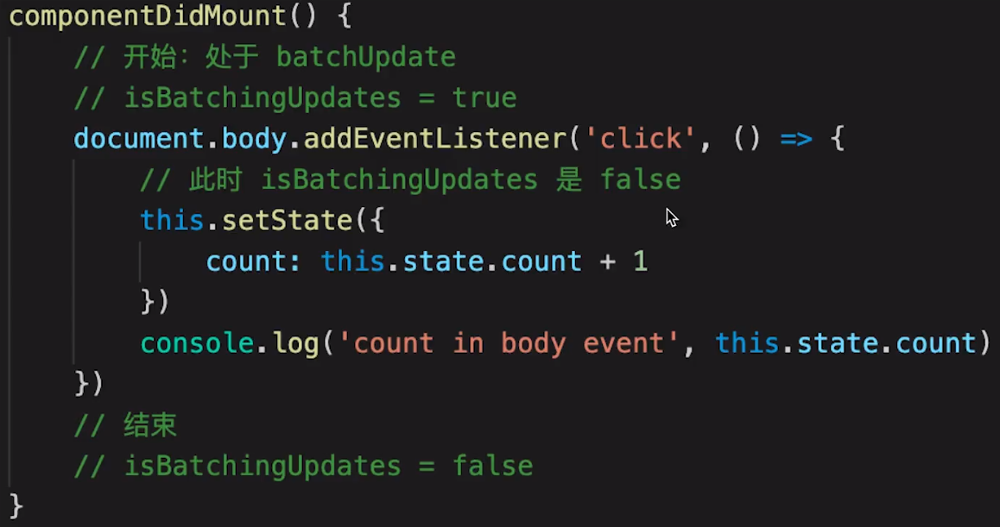
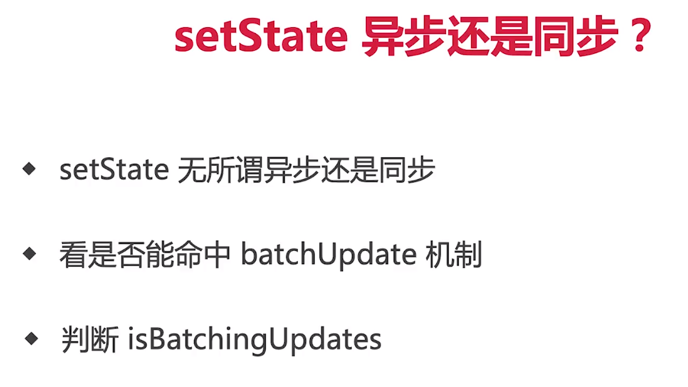

## batchUpdate 机制

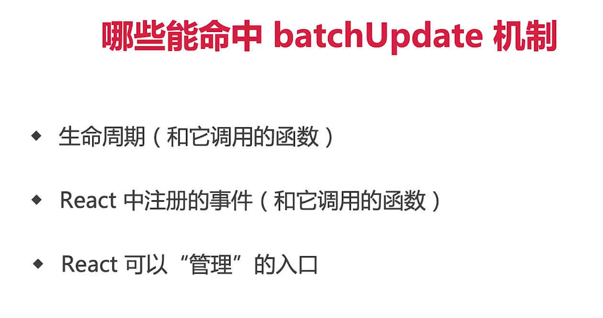
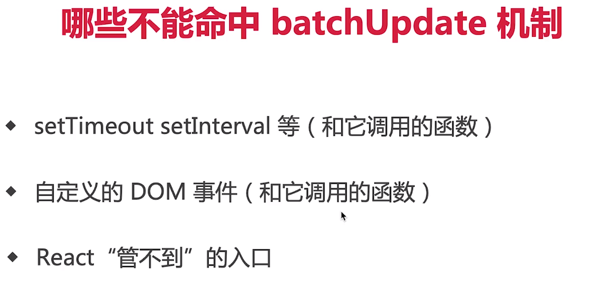

## transaction（事务）机制

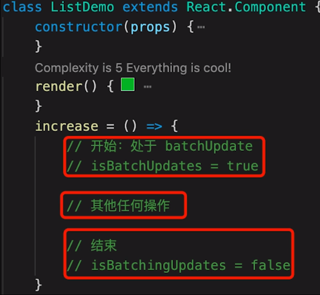
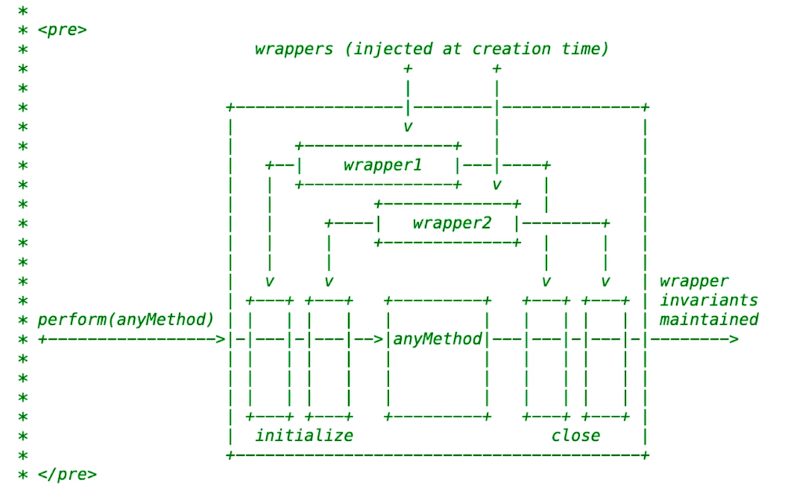
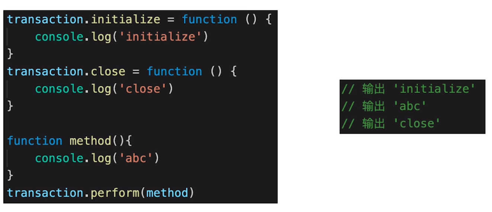

# 组件渲染和更新过程

## 组件渲染过程

- props state
- render() 生成 vnode
- patch(elem,vnode)

## 组件更新过程

- setState(newState)--> dirtyComponents(可能有子组件)
- render() 生成 newVnode
- patch(vnode,newVnode)

## 更新的两个阶段

### patch 被拆分成两个阶段：

- reconciliation 阶段：执行 diff 算法，纯 js 计算
- commit 阶段：将 diff 结果渲染 DOM（浏览器操纵）

> 如果不分的话可能会有性能问题:1.js 是单线程，且与 dom 渲染共用一个线程；2.当组件足够复杂，组件更新时计算和渲染都压力大；3.同时再有 dom 操作需求（动画、鼠标拖拽等），将卡顿。

#### 上述性能问题的解决方案 -- fiber

> React 内部运行机制，开发时体会不到
> 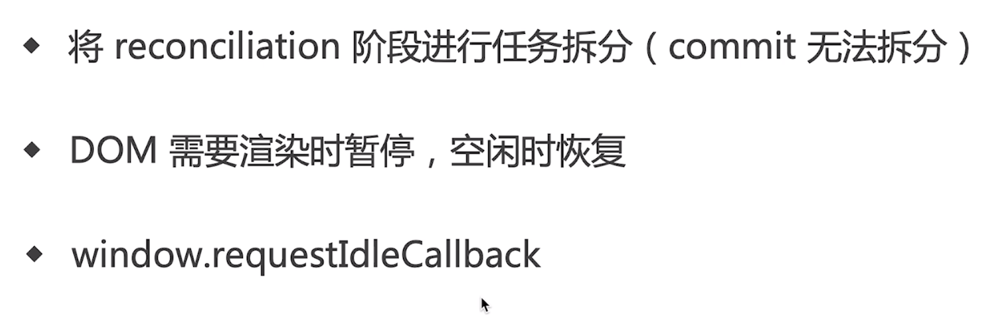

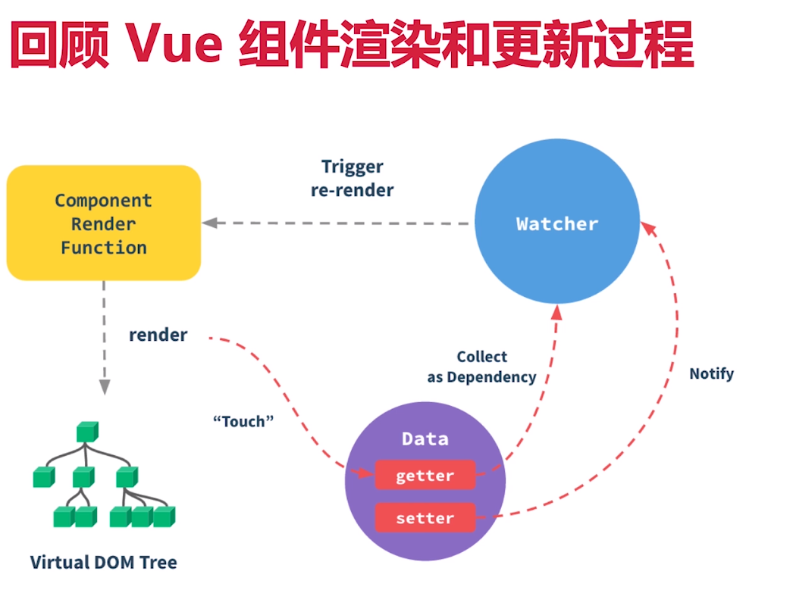

## jsx 如何渲染

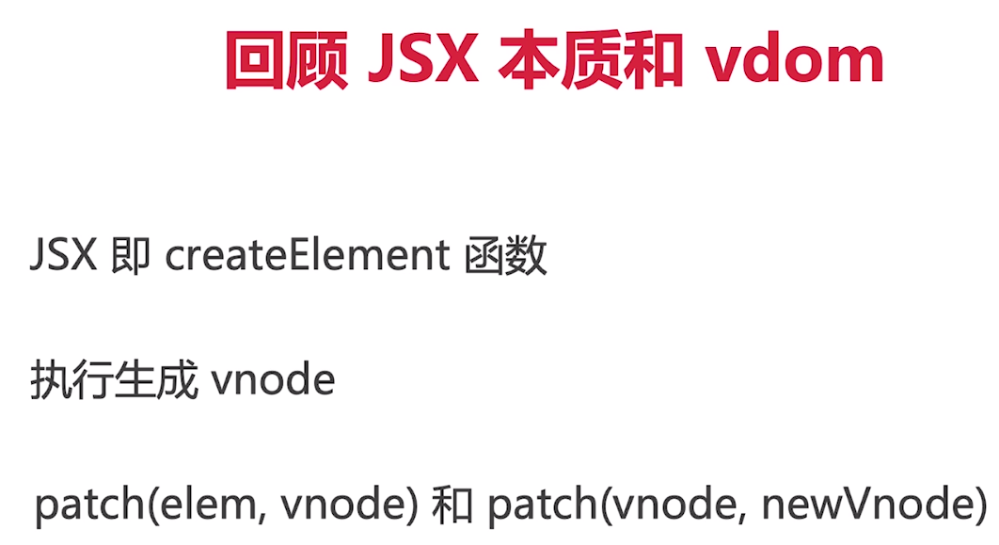
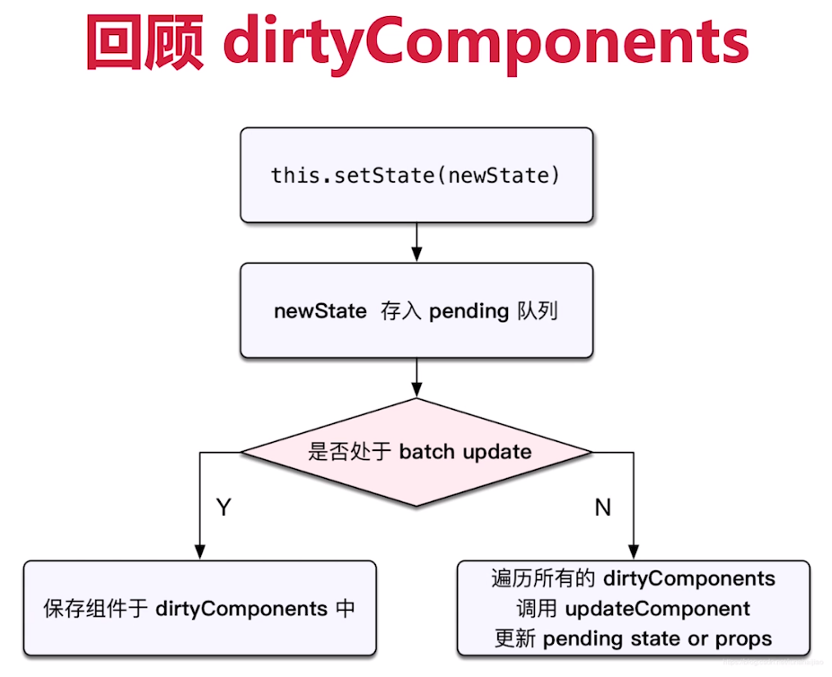

#
