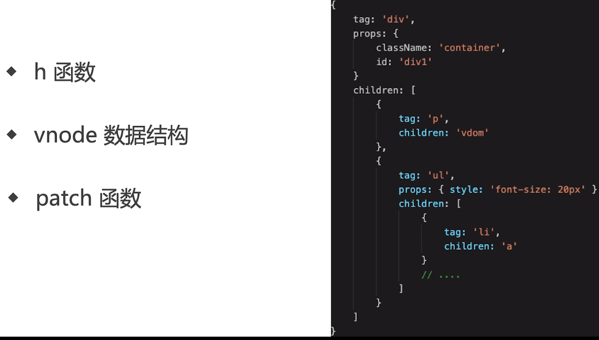
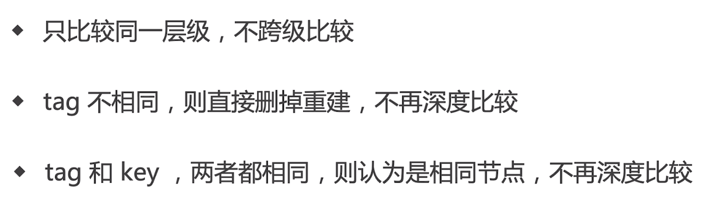
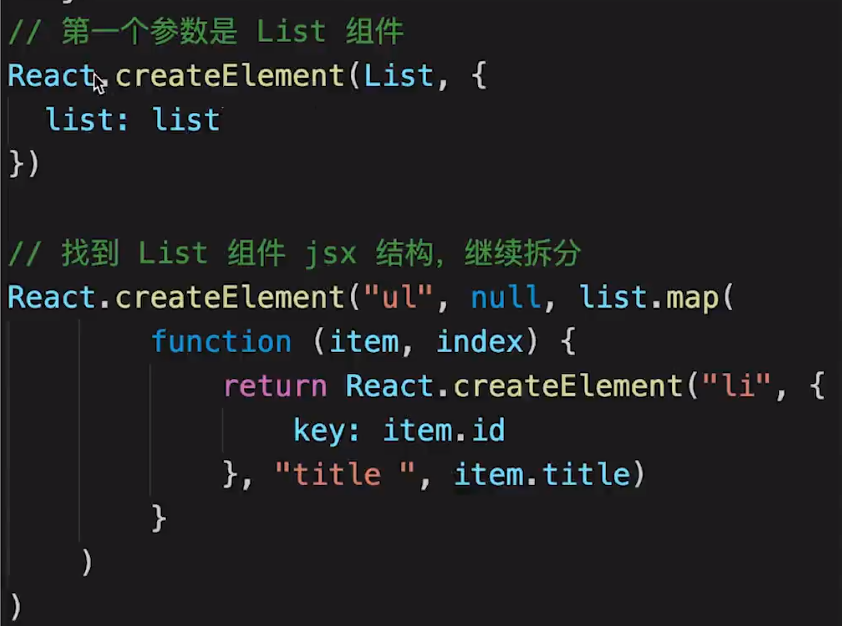
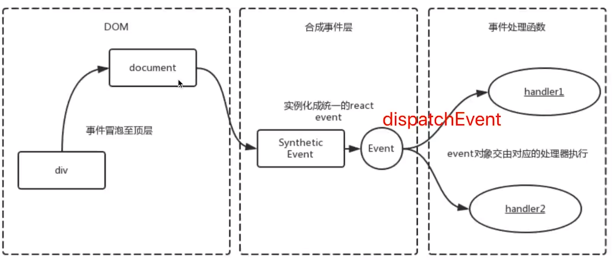

# 函数式编程

> 一种编程范式

- 纯函数
- 不可变值

# vdom 和 diff

## diff 算法

# JSX 本质

> JSX 等同与 vue 模板，Vue 模板不是 html，JSX 也不是 js

- JSX 编译演示：babel 官网-》试一试-》选中 react 依赖
  

# React 的合成事件机制

> react 16 所有事件都挂载到 document 上，react 17 所有事件改为挂载到根元素上

- react event 不是原生的，是 SyntheticEvent 合成事件对象

- react 16 合成事件图示：
  

#

#

#
