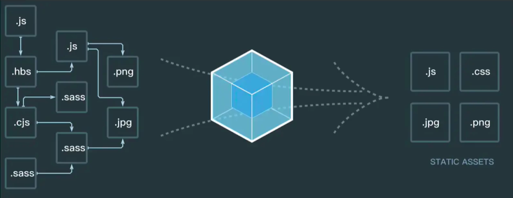

> webpack是前端打包构建的不二选择，重点在于配置和使用，原理学习优先级可降低
# webpack 5 与 4
- 差异不大
- 5 内部效率更高


# 基本配置
### 拆分和merge(通过webpack-merge实现)


### 启动本地服务


### 处理es6


### 处理样式
- postcss-loader // 兼容css，各浏览器版本的前缀，自动加
- 需要安装
    "autoprefixer": "^9.7.3",
     "postcss-loader": "^3.0.0",


- 处理图片
```
 module: {
        rules: [
            // 图片 - 考虑 base64 编码的情况
            {
                test: /\.(png|jpg|jpeg|gif)$/,
                use: {
                    loader: 'url-loader',
                    options: {
                        // 小于 5kb 的图片用 base64 格式产出
                        // 否则，依然延用 file-loader 的形式，产出 url 格式
                        limit: 5 * 1024,

                        // 打包到 img 目录下
                        outputPath: '/img1/',

                        // 设置图片的 cdn 地址（也可以统一在外面的 output 中设置，那将作用于所有静态资源）
                        // publicPath: 'http://cdn.abc.com'
                    }
                }
            },
        ]
    },
```
- contentHash
 

- （模块化）
  
# 高级配置
## 多入口
```
// 1. 多入口配置
entry: {
        index: path.join(srcPath, 'index.js'),
        other: path.join(srcPath, 'other.js')
    },

// 2. output配置
output: {
        // filename: 'bundle.[contentHash:8].js',  // 打包代码时，加上 hash 戳
        filename: '[name].[contentHash:8].js', // name 即多入口时 entry 的 key
        path: distPath,
        // publicPath: 'http://cdn.abc.com'  // 修改所有静态文件 url 的前缀（如 cdn 域名），这里暂时用不到
    },

// 3. plugin示例对应每个入口都要生成
plugins: [
        // new HtmlWebpackPlugin({
        //     template: path.join(srcPath, 'index.html'),
        //     filename: 'index.html'
        // })

        // 多入口 - 生成 index.html
        new HtmlWebpackPlugin({
            template: path.join(srcPath, 'index.html'),
            filename: 'index.html',
            // chunks 表示该页面要引用哪些 chunk （即上面的 index 和 other），默认全部引用
            chunks: ['index']  // 只引用 index.js
        }),
        // 多入口 - 生成 other.html
        new HtmlWebpackPlugin({
            template: path.join(srcPath, 'other.html'),
            filename: 'other.html',
            chunks: ['other']  // 只引用 other.js
        })
    ]
```
## 抽离css文件并压缩
> 避免使用js把css写入到html中，提高性能，代码结构更加合理
```
 // 抽离 css
 module: {
        rules: [
            {
                test: /\.css$/,
                loader: [
                    MiniCssExtractPlugin.loader,  // 注意，这里不再用 style-loader
                    'css-loader',
                    'postcss-loader'
                ]
            },
            // 抽离 less --> css
            {
                test: /\.less$/,
                loader: [
                    MiniCssExtractPlugin.loader,  // 注意，这里不再用 style-loader
                    'css-loader',
                    'less-loader',
                    'postcss-loader'
                ]
            }]
},
plugins: [
             // 抽离 css 文件
        new MiniCssExtractPlugin({
            filename: 'css/main.[contentHash:8].css'
        })
    ],
optimization: {
        // 压缩 css
        minimizer: [new TerserJSPlugin({}), new OptimizeCSSAssetsPlugin({})],
    }
```

## 抽离公共代码、第三方代码
> 减少代码块
build-splitChunks 
webpack.config.js: optimization:{splitChunks:{cacheGroups:{}}},plugin:[new HtmlWebpackPlugin({chunks:[]}),new HtmlWebpackPlugin({chunks:[]})]

## 异步加载js（懒加载）
> webpack 会对异步加载的js进行单独打包 
```
// 正常文件引入，改为如下代码
import('../xx.js').then(res=>{
    res就是引入的内容
})
// webpack 默认支持，不需要额外配置
```

## 处理react
```
// 1. babel官网找到react配置指南，按照要求 npm i相关依赖包
npm i -D @babel/preset-react
// 2. 配置.babelrc
{
    "presets":["@babel/preset-react"]
}
// 3. 配置webpack loader
rules:[{
    test:/\.js$/,
    loader:['babel-loader'],
    include:scrPath,
    exclude:/node_modules/
}]

```

## module chunk bundle的区别
- module：模块，各个源码文件，webpack中一切皆模块
- chunk： 多模块合并成的。如entry inport()  splitChunk
- bundle: 最终的输出文件；一般一个chunk对应一个bundle

# webpack 性能优化：优化打包效率
> 代码位置：build-optimization
## 一、 优化打包构建速度- 开发体验和效率
1. 优化babel-loader
```
{
    test:/\.js$/,
    use:['babel-loader?cacheDirectory'], // 开启缓存，没有变化的就不会再次编译
    include: path.resolve(__dirname,'src'), // 明确范围
    // exclude: path.resolve(__dirname,'node_modules') // 排除范围，与include二选一即可
}
```

2. IgnorePlugin 避免引入无用模块
```
// demo moment库只引入中文
import moment from 'moment'
import 'moment/locale/zh-cn' // 手动引入中文语言包
moment.localse('zh-cn') // 设置语言为中文

// webpack.prod.js
plugin:{
    // 忽略moment下的 /locale 目录
    new webpack.IgnorePlugin(/\./locale/, /moment/)
}
```

3. noParse  避免重复打包
```
module.exports={
    module:{
        // min结尾的文件，大多已经编译过了
        // 如：对完整的 'react.min.js'文件就没有必要再次编译构建
        // 忽略对 'react.min.js' 文件的递归解析处理
        noParse: [/react\.min\.js$/]
    }
}

- 与IgnorePlugin①的区别：IgnorePlugin是直接不引入，代码中没有，需要的东西再单独引入，提高构建速度的同时，可以减小产出文件的体积； noParse 引入，但不进行babel等编译打包操作
```
- #### 多进程优势
    1. 项目较大时，开启多进程可以显著提高打包速度
    2. 项目较小，开启多进程会降低速度（进程启动、通信、销毁会消耗性能）
    3. 按需使用
1. happyPack 多进程打包
- js是单线程的，用以开启多进程
- 提高构建速度，尤其是多核cpu的机器
```
1. 安装：npm i happypack -D
2. 引入：const HappyPack = require('happypack)
3. 改变rules写法,将xx文件的处理交给id为babel的happypack实例处理：rules.use:['happypack/loader?id=babel']
4. 创建happypack实例：plugin: new HappyPack({
    id:'babel', // 唯一标识
    loaders:['babel-loader?cacheDirectory'] // 原有正常的babel配置
})
```

5. ParallelUglifyPlugin  多进程压缩js // 只放在生产环境即可
- webpack 内置uglify工具压缩js，但因js是单线程，需要paralleUglifyPlugin开启多进程，提高压缩更快（和happyPack同理）
```
1. 安装：npm i webpack-parallel-uglify-plugin -D
2. 引入：const ParallelUglifyPlugin = require('webpack-parallel-uglify-plugin)
3. 创建实例：plugin: new ParallelUglifyPlugin({
    uglifyJS:{
        outpout:{
            beautify:false, // 不要美化，用最紧凑的输出
            comments:false, // 删除所有注释
        },
        compress:{
            drop_console:true, // 删除所有console,可以兼容ie
            collapse_vars:true, // 内嵌只用到一次的变量
            reduce_vars:true,// 提取出现多次但没有定义成变量的静态值
        }
    }
})
```

6. 自动刷新 
module.export={
    watch:true, // 开启监听，webpack-dev-server自动开启刷新浏览器。 默认为false。如果使用了webpack-dev-server，则不需要再配，会自动开启刷新浏览器
    watchOptions:{
        ignored:/node_modules/, // 忽略监听的内容
        aggregateTimeout：300， // 默认300，监听修改后300ms后触发刷新
        poll：1000, // 默认每搁1000毫秒询问一次指定文件有没有发生变化
    }
}

7. 热更新
- 自动刷新：整个网页全部刷新，速度较慢；状态会丢失
- 热更新：新代码生效，网页不刷新，状态不丢失。会消耗性能。
```
// 代码地址：frame-project-interview\webpack-demo\src\index.js
1. 引用：const HotModuleReplacementPlugin = require('webpack/lib/HotModuleReplacementPlugin')
2. entry配置：{
    index:['wepack-dev-server/client?http://localhost:8080/','webpack/hot/dev-server',path.join(srcPath,'index.js')],
    other:path.join(srcPath,'other.js')
}
3. 创建实例：plugin: new HotModuleReplacementPlugin( )
4. devServer:{
    hot:true 
}
5. import { sum } from './math' 

// 增加，开启热更新之后的代码逻辑,只有下面被匹配到的内容才会走热更新
if (module.hot) {
    module.hot.accept(['./math'], () => {
        const sumRes = sum(10, 30)
        console.log('sumRes in hot', sumRes)
    })
}
```


8. DllPugin 动态链接库插件（webpack已内置支持）
- DllPlugin：打包出dll.js(index中引用)\manifestt.json(webpack plugin创建实例时引用)文件
- DllReferencePlugin：使用dll文件
```
1. 配置webpack： // D:\BasicsOfFrontend\frame-project-interview\webpack-dll-demo\build\webpack.dll.js
2. 打包
3. 引用：
    1. index中引入<script src="./xx.dll.js"></script>
    2. webpack js rule；exclude: /node_modules/
    3. 实例初始化plugins:[new DllReferencePlugin({
            // 描述 react 动态链接库的文件内容
            manifest: require(path.join(distPath, 'react.manifest.json')),
        }),]
```
   
## 二、 优化产出代码- 产品性能
- 体积更小
- 合理分包，不重复加载
- 速度更快，内存使用更小

# 优化产出代码
- 小图片（小于5kb）使用base64编码产出
- bundle加hash，缓存
- 懒加载
- 提取公共代码
- IngorePlugin // 忽略多语言等
- 使用cdn加速：1.配置output.publicPath:'http://cdn.xxx.com'; (给所有静态文件加前缀)；2. 将本地静态文件上传到所购买的cdn服务器上； 注：rules.use.publicPath，也可以用于图片
- 使用production
- 使用Scope Hosting
# 构建流程概述

# babel

# 前端代码为何要进行构建、打包？

# module chunk bundle 分别是什么意思，有何区别？

# webpack如何实现懒加载？

# webpack常见性能优化

# babel-runtime 和 babel-polyfill的区别