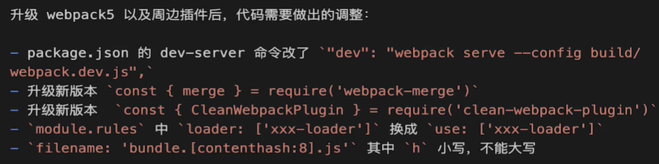
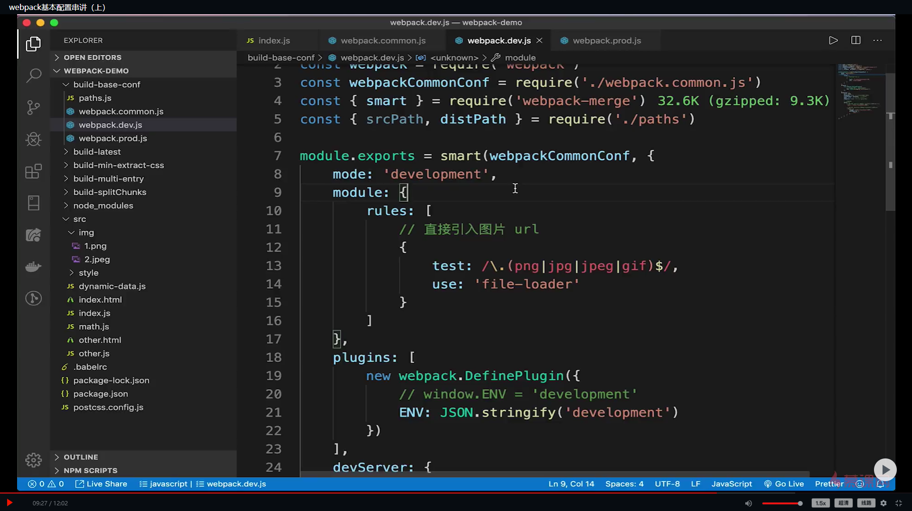
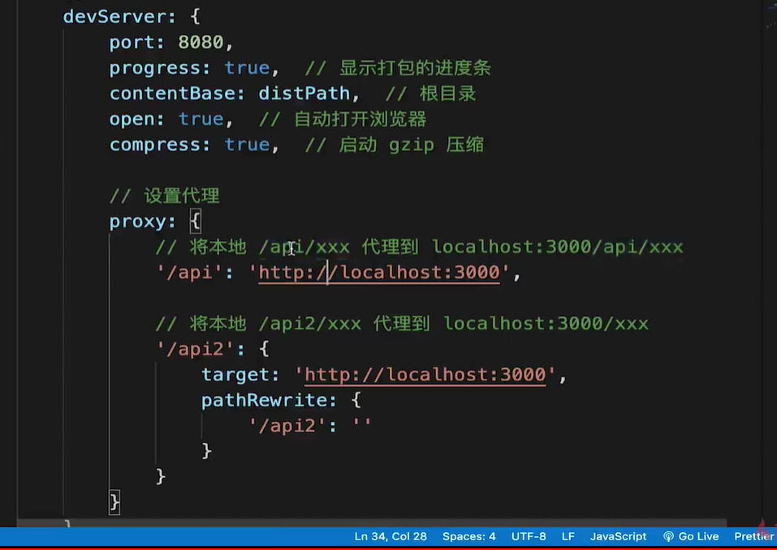
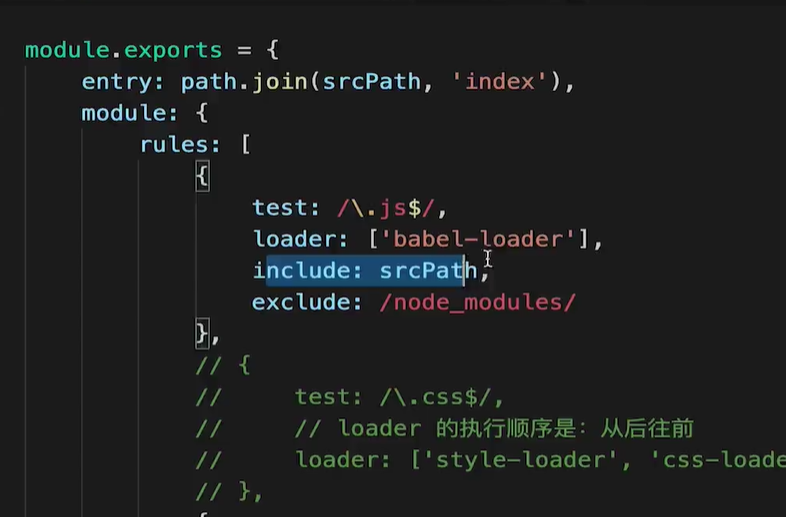
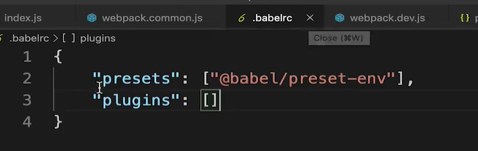
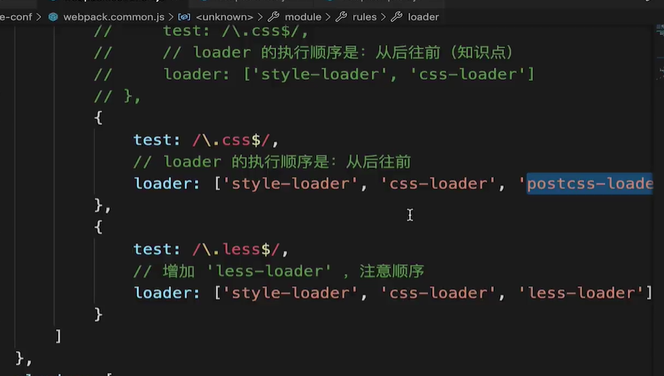
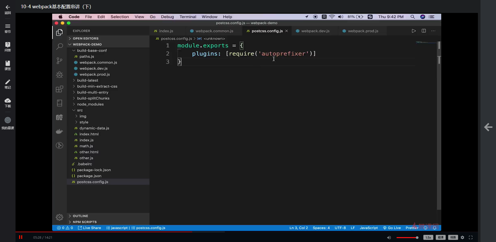
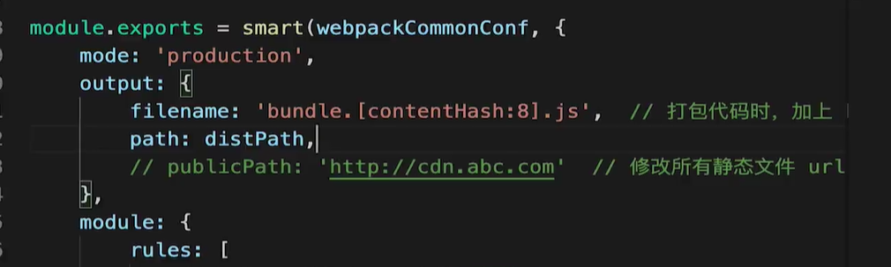

> webpack是前端打包构建的不二选择，重点在于配置和使用，原理学习优先级可降低
# webpack 5 与 4
- 差异不大
- 5 内部效率更高


# 基本配置
### 拆分和merge(通过webpack-merge实现)


### 启动本地服务


### 处理es6



### 处理样式
- postcss-loader // 兼容css，各浏览器版本的前缀，自动加
- 需要安装
    "autoprefixer": "^9.7.3",
     "postcss-loader": "^3.0.0",



- 处理图片
```
 module: {
        rules: [
            // 图片 - 考虑 base64 编码的情况
            {
                test: /\.(png|jpg|jpeg|gif)$/,
                use: {
                    loader: 'url-loader',
                    options: {
                        // 小于 5kb 的图片用 base64 格式产出
                        // 否则，依然延用 file-loader 的形式，产出 url 格式
                        limit: 5 * 1024,

                        // 打包到 img 目录下
                        outputPath: '/img1/',

                        // 设置图片的 cdn 地址（也可以统一在外面的 output 中设置，那将作用于所有静态资源）
                        // publicPath: 'http://cdn.abc.com'
                    }
                }
            },
        ]
    },
```
- contentHash
 

- （模块化）
  
# 高级配置
## 多入口
```
// 1. 多入口配置
entry: {
        index: path.join(srcPath, 'index.js'),
        other: path.join(srcPath, 'other.js')
    },

// 2. output配置
output: {
        // filename: 'bundle.[contentHash:8].js',  // 打包代码时，加上 hash 戳
        filename: '[name].[contentHash:8].js', // name 即多入口时 entry 的 key
        path: distPath,
        // publicPath: 'http://cdn.abc.com'  // 修改所有静态文件 url 的前缀（如 cdn 域名），这里暂时用不到
    },

// 3. plugin示例对应每个入口都要生成
plugins: [
        // new HtmlWebpackPlugin({
        //     template: path.join(srcPath, 'index.html'),
        //     filename: 'index.html'
        // })

        // 多入口 - 生成 index.html
        new HtmlWebpackPlugin({
            template: path.join(srcPath, 'index.html'),
            filename: 'index.html',
            // chunks 表示该页面要引用哪些 chunk （即上面的 index 和 other），默认全部引用
            chunks: ['index']  // 只引用 index.js
        }),
        // 多入口 - 生成 other.html
        new HtmlWebpackPlugin({
            template: path.join(srcPath, 'other.html'),
            filename: 'other.html',
            chunks: ['other']  // 只引用 other.js
        })
    ]
```

## 抽离css文件

# 优化打包效率

# 优化产出代码

# 构建流程概述

# babel

# 前端代码为何要进行构建、打包？

# module chunk bundle 分别是什么意思，有何区别？

# webpack如何实现懒加载？

# webpack常见性能优化

# babel-runtime 和 babel-polyfill的区别