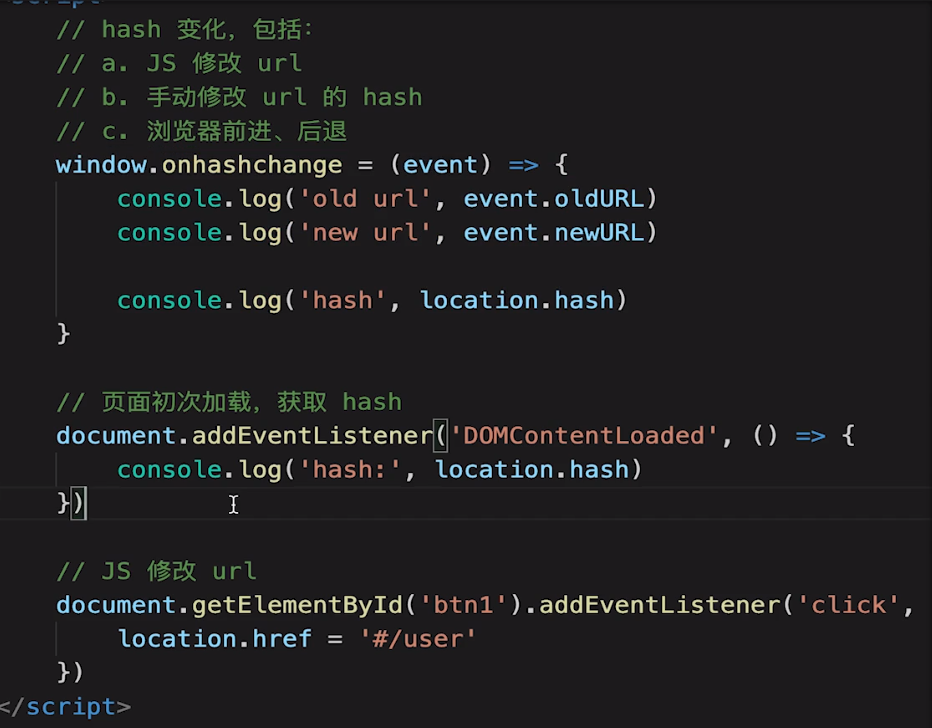
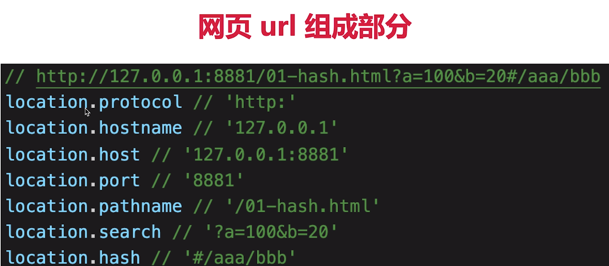
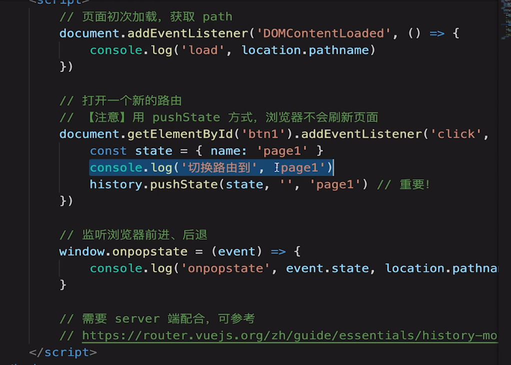

# hash路由
1. hash 变化会触发网页跳转，即浏览器的前进、后退
2. hash 变化不会刷新页面（spa必需的特点）
3. hash 永远不会提交到server端（由前端完全控制，自生自灭于前端）

# H5 history
- 用url规范的路由，但跳转时不刷新页面
- history.pushState
- window.onpopstate
 
 > 服务器端不管拿到什么路由，都直接返回index.html主文件。具体路由由前端通过history.pushState控制

 ### 如何选择
 1. to B的系统推荐用hash，简单易用，对url规范不敏感
 2. to C的系统，可以考虑H5 history，对seo友好，但需要服务端支持
   