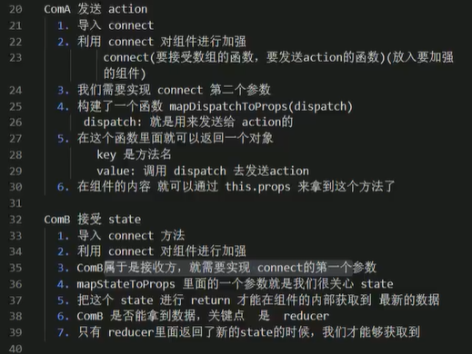

## state 状态
- domainDate： 服务器端数据：用户信息、商品列表
- ui state： 当前ui决定展示的状态，如：弹框、受控组件
- app state: app级别的state，如：请求loading、路由信息等被多组件复用的状态

## action 事件
> 把数据从应用传到store的载体，他是store数据的唯一来源，一般来说，我们可以通过store.dispatch()将action传递给store
- 本质是个JavaScript普通对象
- 必须有一个type属性表示要执行的动作，type多被定义为字符串常量，除type字段外，action结构可随意定义
- 描述有事件发生，不描述如何更新state

## reducer
- 本质是一个函数，用来响应actions，处理后将state发送给store
- 接受两个参数：初始化state和action，需要return返回值，store才能接收到数据

# 小结

## 构建reducer、store
1. 安装依赖
2. 构建reducer（必须要有返回值），来响应actions
3. 构建store，通过createStore方法将reducer传入
4. app.js引入store

## 构建页面结构

## Provider组件实现

## ComA发送action

